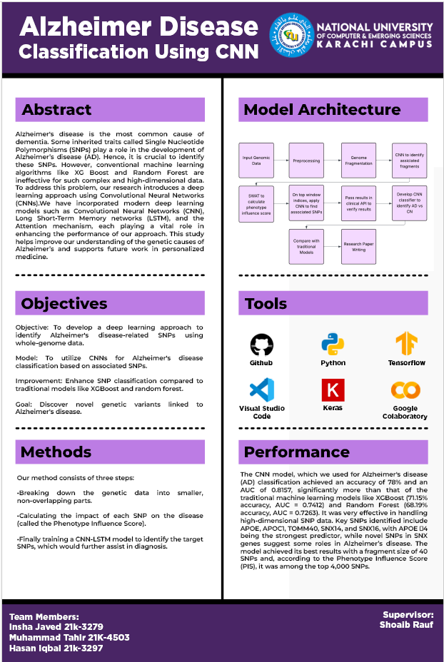

# Identification of Neurological Diseases Using Deep Learning Methods

1. **CNN Architecture and SNP Selection Process**
   - 

---

### 📝 Table of Contents
1. [Project Overview](#project-overview)
2. [Objectives](#objectives)
3. [Methodology](#methodology)
4. [Results](#results)
5. [Key Findings](#key-findings)
6. [Contributions](#contributions)
7. [Future Work](#future-work)
8. [Acknowledgments](#acknowledgments)
9. [References](#references)

---

### 1. Project Overview

This project aims to develop a deep learning-based framework for identifying neurological diseases, specifically Alzheimer's Disease (AD), using Single Nucleotide Polymorphisms (SNPs). By leveraging Convolutional Neural Networks (CNNs) and advanced feature selection techniques, we aim to improve the accuracy of AD classification while maintaining interpretability.

---

### 2. Objectives

- **Primary Objective:** Develop a deep learning model that accurately classifies individuals as either Alzheimer’s Disease (AD) patients or cognitively normal controls based on SNP data.
- **Secondary Objectives:**
  - Identify key SNPs associated with AD using Phenotype Influence Score (PIS).
  - Compare the performance of CNNs with traditional machine learning models like Random Forest and XGBoost.
  - Enhance model interpretability using SHAP analysis to understand which SNPs contribute most to predictions.

---

### 3. Methodology

The project follows a structured pipeline consisting of three main steps:

#### Step 1: Genome Fragmentation
- **Purpose:** Divide genomic data into non-overlapping fragments to make analysis computationally efficient.
- **Process:**
  - Genomic data is fragmented into distinct regions.
  - Each fragment serves as input to a hybrid CNN-LSTM model for phenotype-associated fragment identification.
  - This ensures focused analysis on regions likely containing significant genetic information related to AD.

#### Step 2: Phenotype Influence Score (PIS) Calculation
- **Purpose:** Identify significant SNPs associated with phenotypic traits using CNNs.
- **Process:**
  - CNNs are used to calculate PIS for each SNP.
  - SNPs with higher scores are ranked as more critical for AD classification.
  - This reduces dimensionality by focusing on key SNPs, simplifying downstream tasks while preserving critical genetic information.

#### Step 3: Classification Model Development
- **Purpose:** Train a specialized CNN to classify AD versus cognitively normal individuals.
- **Process:**
  - A CNN is trained using the selected SNPs identified in the previous steps.
  - The model focuses on the most relevant genetic variations, providing predictions for disease classification.
  - The final model demonstrates the potential of combining genomics with machine learning for AD diagnosis.

---

### 4. Results

#### Key Visualizations:
1. **CNN Architecture and SNP Selection Process**
   - 
     - **Description:** The architecture of the proposed CNN model for AD classification. It processes SNP data through 1D CNN layers, max pooling, and fully connected layers. The figure also illustrates the SNP selection process using Sliding Window Association Test (SWAT) and Phenotype Influence Score (PIS).

2. **Model Accuracy Comparison**
   - 
     - **Description:** Bar chart comparing the accuracy of CNN, Random Forest, and XGBoost models. The CNN achieves the highest accuracy, demonstrating its superiority in capturing complex genetic interactions.

3. **SHAP Summary Plot**
   - 
     - **Description:** SHAP summary plot showing feature importance for AD classification. High values of important SNPs (e.g., APOE, TOMM40) push predictions toward Alzheimer’s disease, while low values favor cognitively normal outcomes.

4. **Pipeline Overview**
   - 
     - **Description:** Flowchart illustrating the overall pipeline from input genomic data to final classification using CNNs.

---

### 5. Key Findings

- **Improved Classification Accuracy:** The CNN model achieved an accuracy of **78.54%**, outperforming traditional machine learning methods such as Random Forest (75%) and XGBoost (73%).
- **Feature Importance:** Key SNPs identified include those near genes like **APOE**, **TOMM40**, and **SNX14**, aligning with existing biological knowledge.
- **Interpretability:** SHAP analysis revealed that SNPs within genes such as APOE and TOMM40 were highly influential in predicting AD, highlighting their role in neurodegeneration.

---

### 6. Contributions

- Developed a robust pipeline for SNP-based AD classification using deep learning.
- Integrated CNNs to automatically extract hierarchical features from raw genotype data, reducing manual feature engineering.
- Enhanced model interpretability using SHAP analysis to identify biologically meaningful SNPs.
- Demonstrated superior performance compared to traditional machine learning models.

---

### 7. Future Work

- Expand dataset size and diversity through multi-cohort integration.
- Integrate multi-omics data (e.g., transcriptomics, epigenetics) to enrich biological context.
- Apply interpretable AI methods (e.g., SHAP, attention mechanisms, Grad-CAM) to improve transparency.
- Explore graph-based neural networks for modeling SNP–SNP interactions.

---

### 8. Acknowledgments

We would like to express our gratitude to:

- **Supervisor:** Sir Shoaib Rauf for his guidance and support throughout the project.
- **Team Members:** Muhammad Tahir (K21-4503), Insha Javed (K21-3279), Hasan Iqbal (K21-3297) for their contributions.
- **National University of Computer & Emerging Sciences (NUCES)** for providing resources and facilities.

---

### 9. References

- Lee H, Wong M, Kim C, et al. An Alzheimer’s disease gene prediction method based on the ensemble of genome-wide association study summary statistics. *Neurogenetics*. 2022;23:145–156.
- Zhang Q, Zhang L, Zhao Y, et al. AD-Syn-Net: systematic identification of Alzheimer’s disease-associated mutation and co-mutation vulnerabilities via deep learning. *Nat Commun*. 2023;14:567–578.
- Wang Z, Li J, Chen X, et al. Wide and deep learning-based approaches for classification of Alzheimer’s disease using genome-wide association studies. *IEEE Trans Biomed Eng*. 2023;70:2546–2555.
- Tan Y, Xu X, Liu X, et al. Use of deep-learning genomics to discriminate healthy individuals from those with Alzheimer’s disease or mild cognitive impairment. *J Alzheimers Dis*. 2021;82:1403–1415.
- Zhang H, Wang R, Zhao Z, et al. A machine learning method to identify genetic variants potentially associated with Alzheimer’s disease. *Front Genet*. 2021;12:735248.

---

### 📂 Directory Structure

```
├── README.md          # This file
├── images/
│   ├── cnn_architecture.png
│   ├── model_accuracy_comparison.png
│   ├── shap_summary_plot.png
│   ├── pipeline_overview.png
│   └── ...
├── src/
│   ├── preprocessing.py
│   ├── cnn_model.py
│   ├── shap_analysis.py
│   └── ...
├── data/
│   ├── adni_dataset.csv
│   └── ...
└── reports/
    ├── final_report.pdf
    └── ...
```

---

## ✨ How to Run

1. **Clone the Repository:**
   ```bash
   git clone https://github.com/yourusername/identification-of-neurological-diseases.git
   ```

2. **Install Dependencies:**
   ```bash
   pip install -r requirements.txt
   ```

3. **Run Preprocessing:**
   ```bash
   python src/preprocessing.py
   ```

4. **Train the Model:**
   ```bash
   python src/cnn_model.py
   ```

5. **Generate SHAP Analysis:**
   ```bash
   python src/shap_analysis.py
   ```

---

## 🚀 Contact

For inquiries or collaboration, please reach out to:
- Muhammad Tahir (K21-4503)
- Insha Javed (K21-3279)
- Hasan Iqbal (K21-3297)

---
